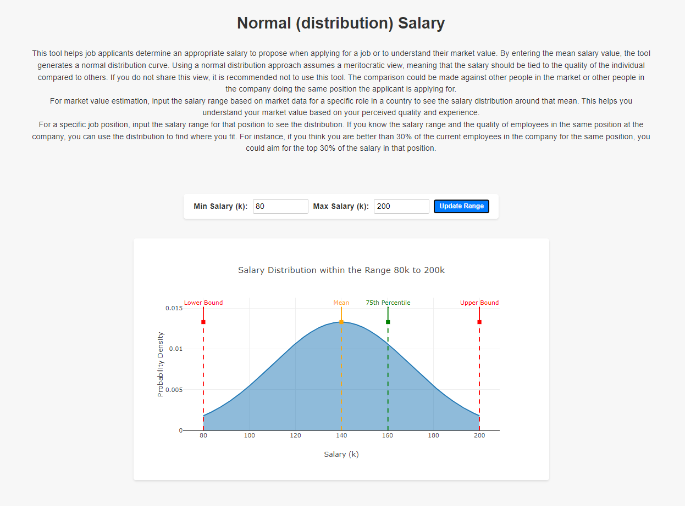
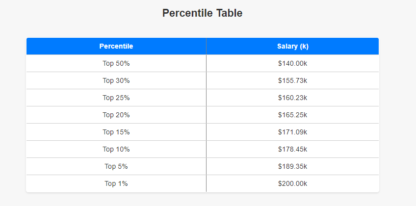

# Salary Range Distribution Tool

This tool helps job applicants determine an appropriate salary to propose when applying for a job or to understand their market value based on a normal distribution curve. 
<br >
<br >

## Features

- Calculate salary distribution based on salary range.
- Generate a normal distribution curve.
- Provide percentile values to help understand the salary distribution.

<br >

## Screenshots





<br >

## How to Use

1. **Market Value Estimation**:
   - Input the salary range based on market data for a specific role in a country to see the salary distribution around that range. This helps you understand your market value based on your perceived quality and experience.

2. **Specific Job Position**:
   - Input the salary range for that position to see the distribution. If you know the salary range and the quality of employees in the same position at the company, you can use the distribution to find where you fit. For instance, if you think you are better than 30% of the current employees in the company for the same position, you could aim for the top 30% of the salary in that position.

   <br >

## Installation

### Prerequisites

- Python 3.6+
- Virtualenv

### Steps

1. Clone the repository:
    ```bash
    git clone https://github.com/henrique-efonseca/salary-range-distribution-tool.git
    cd salary-range-distribution-tool
    ```

2. Create and activate a virtual environment:
    ```bash
    python -m venv venv
    source venv/bin/activate  # On Windows use `venv\Scripts\activate`
    ```

3. Install the required dependencies:
    ```bash
    pip install -r requirements.txt
    ```

4. Run the Flask application:
    ```bash
    python run.py
    ```

5. Open your browser and navigate to `http://127.0.0.1:5000`.

